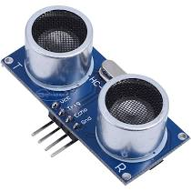
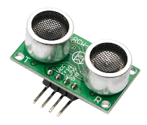
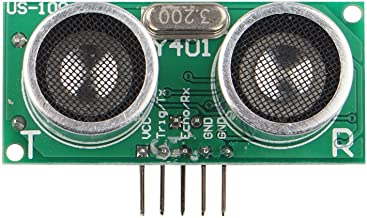

# HC-SR04 Driver
## Overview
A Mongoose OS library for HC-SR04, a popular ultrasonic distance sensor, and for a bunch of [compatible sensors](#compatible-sensors).
## GET STARTED
Build up your own device in few minutes just starting from one of the following samples.

|Sample|Notes|
|--|--|
|[hcsr04-demo](https://github.com/zendiy-mgos/hcsr04-demo)|It shows you how to build a firmware for measuring distances with a HC-SR04 sensor.|
## Usage
Include the library into your `mos.yml` file.
```yaml
libs:
  - origin: https://github.com/zendiy-mgos/hcsr04
```
If you are developing a JavaScript firmware, load `api_hcsr04.js` in your `init.js` file.
```js
load('api_hcsr04.js');
```
## C/C++ API Reference
### mgos_hcsr04_create()
```c
struct mgos_hcsr04 *mgos_hcsr04_create(int trig_pin, int echo_pin);
```
Create and initialize the sensor instance. Returns the instance, or `NULL` on error.

|Parameter||
|--|--|
|trig_pin|'TRIGGER' GPIO pin.|
|echo_pin|'ECHO' GPIO pin.|

**Example** - Create and initialize an HC-SR04 sensor instance.
```c
struct mgos_hcsr04 *my_hcsr04 = mgos_hcsr04_create(2, 12);
```
### mgos_hcsr04_get_echo()
```c
long mgos_hcsr04_get_echo(struct mgos_hcsr04 *sensor);
```
Returns echo duration in microseconds or `-1` on failure.

|Parameter||
|--|--|
|sensor|Sensor instance.|

**Example** - Create and initialize an HC-SR04 sensor instance and print the computed echo's duration.
```c
struct mgos_hcsr04 *my_hcsr04 = mgos_hcsr04_create(2, 12);
long duration = mgos_hcsr04_get_echo(my_hcsr04);
if (duration != -1)
  LOG(LL_INFO, ("Echo duration: %.2lf(microseconds)", duration));
else
  LOG(LL_ERROR, ("Echo duration: error computing duration"));
```
### mgos_hcsr04_get_distance()
```c
float mgos_hcsr04_get_distance(struct mgos_hcsr04 *sensor);
```
Returns distance in millimiters or `NAN` on failure. The default air temperature (19.307°C) is used for calculating the sound speed.

|Parameter||
|--|--|
|sensor|Sensor instance.|

**Example** - Create and initialize an HC-SR04 sensor instance and print the measured distance.
```c
struct mgos_hcsr04 *my_hcsr04 = mgos_hcsr04_create(2, 12);
float distance = mgos_hcsr04_get_distance(my_hcsr04);
if (!isnan(distance))
  LOG(LL_INFO, ("Distance: %.2lf", distance));
else
  LOG(LL_ERROR, ("Distance: error reading distance"));
```
### mgos_hcsr04_get_distance_t()
```c
float mgos_hcsr04_get_distance_t(struct mgos_hcsr04 *sensor, float temperature);
```
Returns distance in millimiters or `NAN` on failure.

|Parameter||
|--|--|
|sensor|Sensor instance.|
|temperature|Air temperature in °C.|

**Example** - Create and initialize an HC-SR04 sensor instance and print the measured distance considering 20.5°C air temperature.
```c
struct mgos_hcsr04 *my_hcsr04 = mgos_hcsr04_create(2, 12);
float distance = mgos_hcsr04_get_distance_t(my_hcsr04, 20.5);
if (!isnan(distance))
  LOG(LL_INFO, ("Distance: %.2lf", distance));
else
  LOG(LL_ERROR, ("Distance: error reading distance"));
```
### mgos_hcsr04_get_distance_avg()
```c
float mgos_hcsr04_get_distance_avg(struct mgos_hcsr04 *sensor,
                                   int attempts_count,
                                   int attempts_delay);
```
Perform multiple measurements and return the average distance in millimiters or `NAN` on failure. The default air temperature (19.307°C) is used for calculating the sound speed.

|Parameter||
|--|--|
|sensor|Sensor instance.|
|attempts_count|How many measurement attempts to perform.|
|attempts_delay|Delay (in milliseconds) between attempts. If -1, the DEFAULT_AVG_ATTEMPTS_DELAY value is used (5ms).|

**Example** - Create and initialize an HC-SR04 sensor instance, perform 10 measurements and print the average measured distance.
```c
struct mgos_hcsr04 *my_hcsr04 = mgos_hcsr04_create(2, 12);
float distance = mgos_hcsr04_get_distance_avg(my_hcsr04,
  10, DEFAULT_AVG_ATTEMPTS_DELAY);
if (!isnan(distance))
  LOG(LL_INFO, ("Distance: %.2lf", distance));
else
  LOG(LL_ERROR, ("Distance: error reading distance"));
```
### mgos_hcsr04_get_distance_avg_t()
```c
float mgos_hcsr04_get_distance_avg_t(struct mgos_hcsr04 *sensor,
                                     int attempts_count,
                                     int attempts_delay,
                                     float temperature);
```
Perform multiple measurements and return the average distance in millimiters or `NAN` on failure.

|Parameter||
|--|--|
|sensor|Sensor instance.|
|attempts_count|How many measurement attempts to perform.|
|attempts_delay|Delay (in milliseconds) between attempts. If -1, the DEFAULT_AVG_ATTEMPTS_DELAY value is used (5ms).|
|temperature|Air temperature in °C.|

**Example** - Create and initialize an HC-SR04 sensor instance, perform 10 measurements and print the average measured distance considering 20.5°C air temperature.
```c
struct mgos_hcsr04 *my_hcsr04 = mgos_hcsr04_create(2, 12);
float distance = mgos_hcsr04_get_distance_avg_t(my_hcsr04,
  10, DEFAULT_AVG_ATTEMPTS_DELAY, 20.5);
if (!isnan(distance))
  LOG(LL_INFO, ("Distance: %.2lf", distance));
else
  LOG(LL_ERROR, ("Distance: error reading distance"));
```
### mgos_hcsr04_close()
```c
void mgos_hcsr04_close(struct mgos_hcsr04 *sensor);
```
Close/destroy the sensor instance.

|Parameter||
|--|--|
|sensor|Sensor instance.|

**Example** - Create and initialize an HC-SR04 sensor instance, do something(...) and then close the instance.
```c
struct mgos_hcsr04 *my_hcsr04 = mgos_hcsr04_create(2, 12);
float distance = mgos_hcsr04_get_distance(my_hcsr04);
...
mgos_hcsr04_close(my_hcsr04);
```
## JS API Reference
### HCSR04.create()
```js
HCSR04.create(trig_pin, echo_pin);
```
Create and initialize the sensor instance. Returns the instance, or `null` on error.

|Parameter||
|--|--|
|trig_pin|'TRIGGER' GPIO pin.|
|echo_pin|'ECHO' GPIO pin.|

**Example** - Create and initialize an HC-SR04 sensor instance.
```js
let myHCSR04 = HCSR04.create(2, 12);
```
### .getEcho()
```js
let duration = myHCSR04.getEcho();
```
Returns echo duration in microseconds or `-1` on failure.

**Example** - Create and initialize an HC-SR04 sensor instance and print the computed echo's duration.
```js
let myHCSR04 = HCSR04.create(2, 12);
let duration = myHCSR04.getEcho();
print('Echo duration:', (duration == -1 ? 'error computing duration' : duration));
```
### .getDistance()
```js
let distance = myHCSR04.getDistance(temperature);
```
Returns distance in millimiters or `NaN` on failure.

|Parameter||
|--|--|
|temperature|Optional. Air temperature in °C. If not specified, the default value is used (19.307°C).|

**Example** - Create and initialize an HC-SR04 sensor instance and print the measured distance.
```js
let myHCSR04 = HCSR04.create(2, 12);
let distance = myHCSR04.getDistance();
print('Distance:', (isNaN(distance) ? 'error reading distance' : distance));
```
### .getAvgDistance()
```js
let distance = myHCSR04.getAvgDistance(attemptsCount, attemptsDelay, temperature);
```
Perform multiple measurements and return the average distance in millimiters or `NaN` on failure.

|Parameter||
|--|--|
|attemptsCount|How many measurement attempts to perform.|
|attemptsDelay|Optional. Delay (in milliseconds) between attempts. If -1 or not specified, the default value is used (5ms).|
|temperature|Optional. Air temperature in °C. If not specified, the default value is used (19.307°C).|

**Example** - Create and initialize an HC-SR04 sensor instance, perform 10 measurements and print the average measured distance.
```js
let myHCSR04 = HCSR04.create(2, 12);
let distance = myHCSR04.getAvgDistance(10);
print('Distance:', (isNaN(distance) ? 'error reading distance' : distance));
```
### .close()
```js
myHCSR04.close();
```
Close/destroy the sensor instance.

**Example** - Create and initialize an HC-SR04 sensor instance, do something(...) and then close the instance.
```js
let myHCSR04 = HCSR04.create(2, 12);
...
myHCSR04.close();
```
## Compatible sensors
You can use one of the following sensors.
||Model|Notes|
|--|--|--|
||HC-SR04|The HC-SR04 is the most popular ultrasonic distance sensor. This sensor usually runs from 5V. So, if your microcontroller runs from 3.3V (e.g.: ESP8266), please take one of the following options into account:<ul><li>Use the newer version that natively supports 3.3V as well.</li><li>Add a logic level shifters/dividers to the circuit (see [anjoschu's post](https://www.instructables.com/id/Modify-Ultrasonic-Sensors-for-3-Volts-Logic-prepar/))</li><li>Use it "as is" assuming that microcontroller's GPIO inputs are 5V tollerant. For instance, there has been some [debate on whether the ESP8266 is actually 5V tolerant on GPIO inputs](https://www.ba0sh1.com/blog/2016/08/03/is-esp8266-io-really-5v-tolerant/). I personally used this configuration connecting the sensor to a Wemos D1 mini v3.0.0 without having any issue.</li></ul>.|
||RCW-0001|The RCW-0001 is fully equivalent to the HC-SR04 sensor.<ul><li>This sensor can run from 3.3-5V so you don't need any logic level shifters or dividers. Just power from whatever your microcontroller provides.</li></ul>|
||US-100|The US-100 is very similar to the popular HC-SR04 ultrasonic sensors.<ul><li>This sensor can run from 3-5V so you don't need any logic level shifters or dividers. Just power from whatever your microcontroller provides.</li><li>It supports both "HC-SR04" mode and "Serial UART" mode, but **the "HC-SR04" mode must be set** for using this library.</li></ul>|
